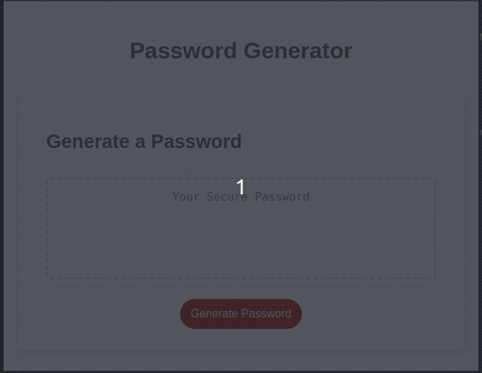

# Super secret password generator 

## Table of Contents

- [Scope of Work](#scope-of-work)
- [Sample](#sample)
- [Live Website](#live-website)
- [Copyright](#copyright)

## Scope of Work

Build a complex password generator that ignores most, if not all, of NIST SP 800-63B (at least what I understand of it).

## Sample

## Live Website

Browse to https://mycomplex.github.io/passive_degenerate/ to review.

## Copyright

Provided starter code copyright to its respective owner(s).
